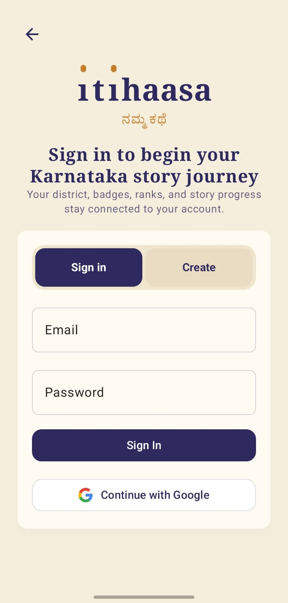
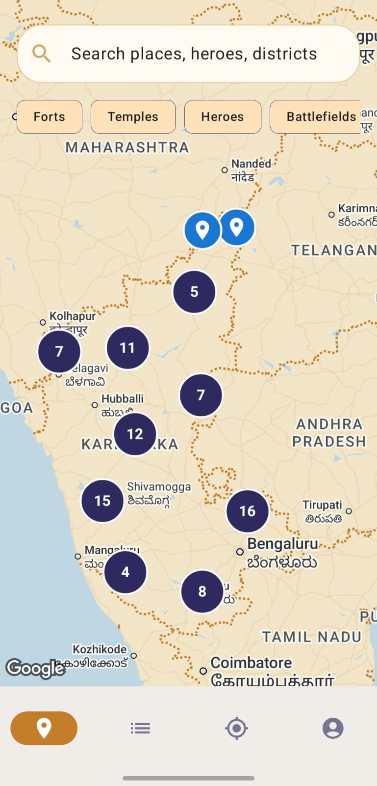
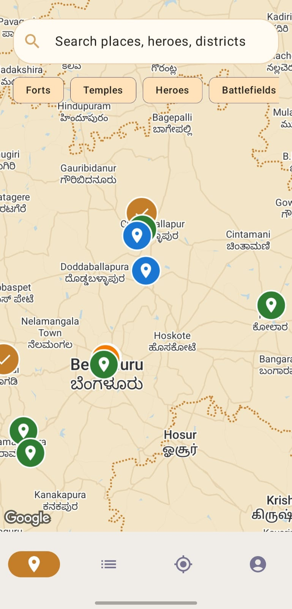
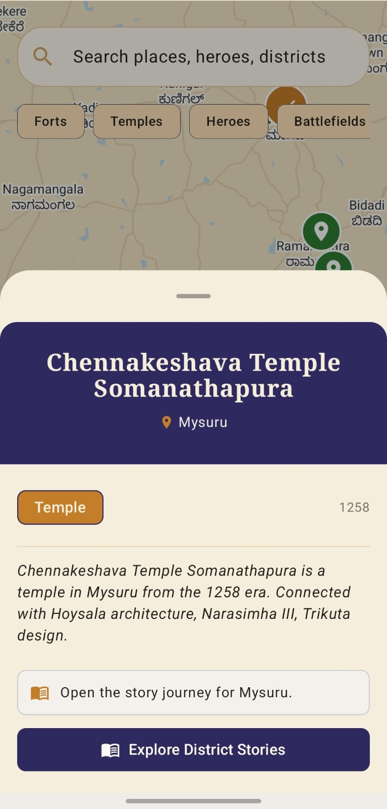
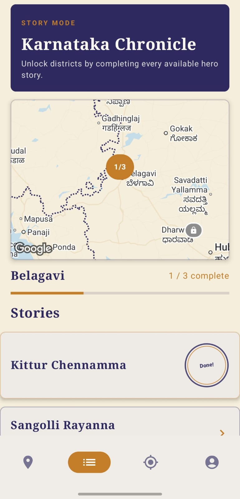
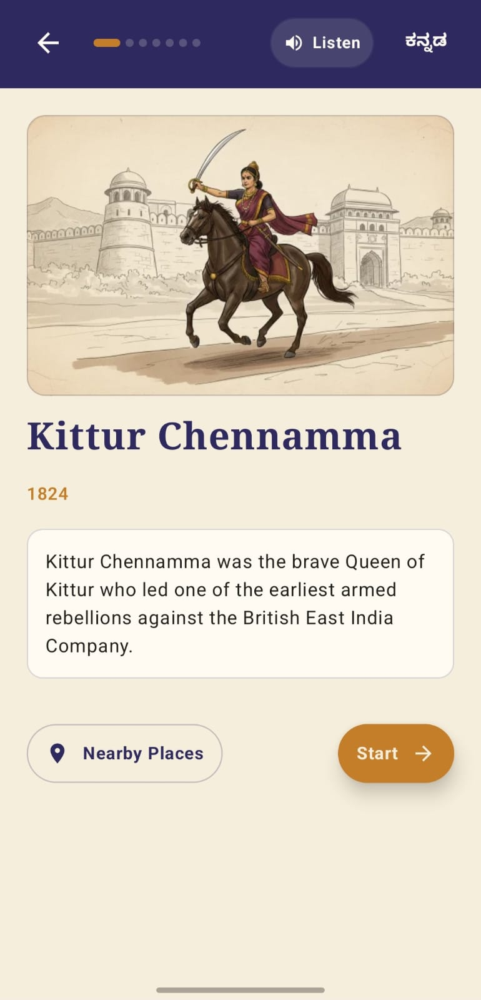
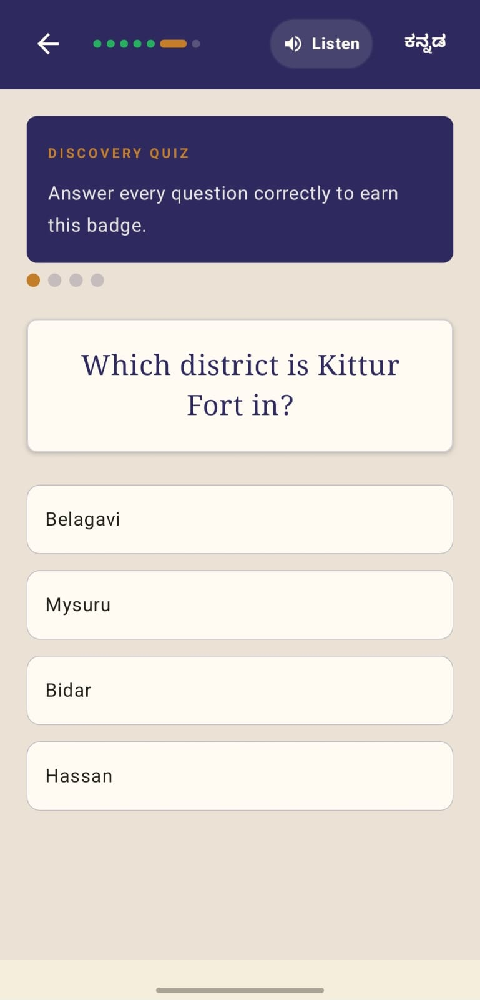
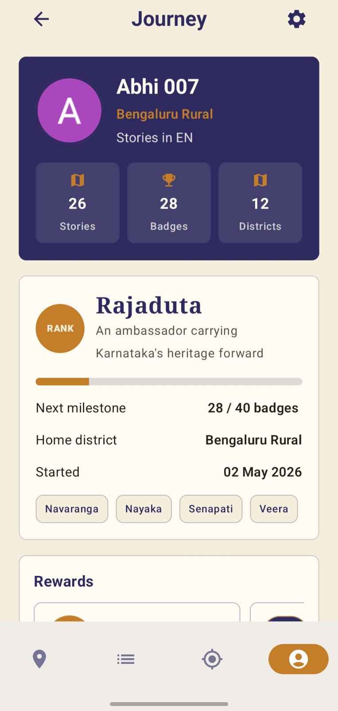
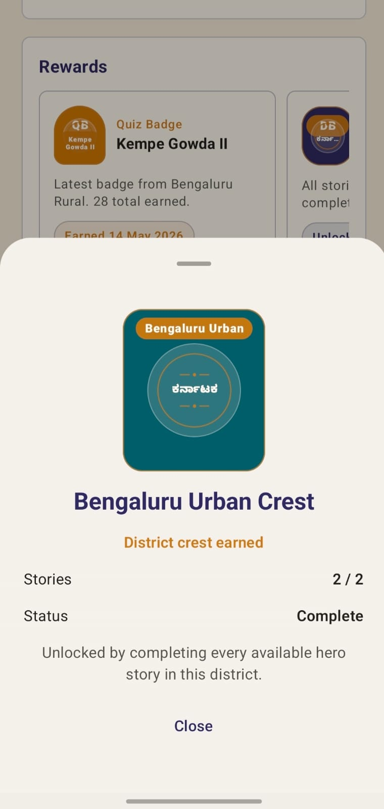
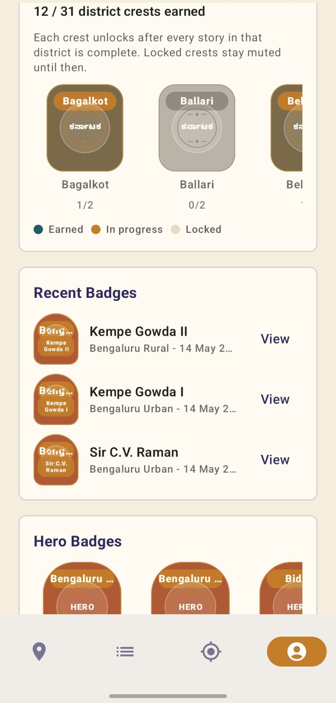

# Namma Kathey (Itihaasa)

Namma Kathey (Itihaasa) is a gamified Android app that helps users explore Karnataka’s history through interactive district journeys, hero stories, quizzes, collectible badges, and map-based progression.

## Features

- Story Mode: district-wise hero stories
- Quiz-based hero badges
- District crests for completing all stories in a district
- Explorer ranks based on collected stories/badges
- Karnataka map with district pins showing progress and lock state
- Cloud-synced progress (Firebase Auth + Firestore)
- Connectivity-aware state handling to prevent inconsistent or partially synced progress.

## Tech Stack

- Kotlin + Jetpack Compose (Material 3)
- Navigation Compose
- Firebase Auth (Google sign-in)
- Firebase Firestore (progress, badges, unlocked districts)
- Google Maps (Maps Compose)
- Hilt DI
- Coil (image loading)

## Architecture

The app follows MVVM architecture with repository-based data access and unidirectional UI state management using Jetpack Compose.

## Requirements

- Android Studio (recent stable)
- JDK 17
- Android SDK (compile/target SDK configured in `app/build.gradle.kts`)
- A Firebase project (Auth + Firestore)
- A Google Maps API key

## Screenshots (User Journey)

<p align="center">
  
  
  
  
  
</p>

<p align="center">
  
  
  
  
  
</p>

## Repo Notes (What Is Not Committed)

For safety, the repo ignores local and secret files (see `.gitignore`):

- `local.properties` (contains `MAPS_API_KEY` locally)
- `google-services.json` (Firebase config)
- keystores (`*.jks`, `*.keystore`, `*.p12`, etc.)
- local notes like `aboutapp.md`

If you are cloning this repo, you must add your own `google-services.json` and API keys locally.

## Setup

### 1. Firebase

1. Create a Firebase project.
2. Add an Android app in Firebase using the package name:
   - `com.itihaasa.nammakathey`
3. Enable Authentication providers you use (Google sign-in is integrated).
4. Create a Firestore database and deploy your rules (a `firestore.rules` file exists at repo root).
5. Download `google-services.json` and place it at:
   - `app/google-services.json`

Note: this file is ignored by git, so it will stay local.

### 2. Google Maps API Key

This app reads the Maps key from `MAPS_API_KEY` and injects it into the manifest placeholder `${MAPS_API_KEY}`.

Put the key in `local.properties` (repo root):

```
MAPS_API_KEY=YOUR_KEY_HERE
```

Do not commit this key. The repo already ignores `local.properties`.

### 3. Build and Run

Open the project in Android Studio and run the `app` configuration.

If you prefer command line:

```
./gradlew :app:assembleDebug
```

## Project Structure (High Level)

- `app/src/main/java/.../ui/`
  - `map/` map screen and progress pins
  - `story/` story mode, quiz flow, unlock flow, badge celebrations
  - `profile/` profile setup and profile views
- `app/src/main/java/.../data/`
  - repositories and data sources (Firestore progress, local JSON)
- `app/src/main/assets/`
  - story content JSON and related assets

